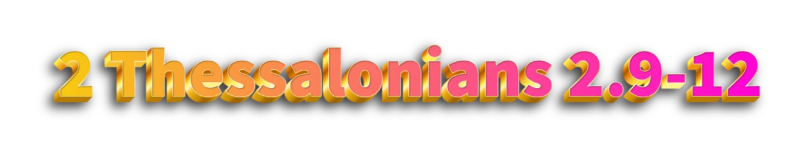

<iframe src="https://subsplash.com/+d6kc/lb/mi/+59534ds?embed=true&recentRoute=app.web-app.library.media-series&recentRouteSlug=%2B82yxp8f" frameborder="0" webkitallowfullscreen mozallowfullscreenallowfullscreen style="position:absolute;top:0;left:0;width:100%;height:100%;"></iframe>

---

- 18 Little children, it is the last time: and as ye have heard that antichrist shall come, even now are there many antichrists; whereby we know that it is the last time.
- 19 They went out from us, but they were not of us; for if they had been of us, they would *no* *doubt* have continued with us: but *they* *went* *out*, that they might be made manifest that they were not all of us.
- 20 But ye have an unction from the Holy One, and ye know all things.

Unction = anointing

---

- BELOVED, believe not every spirit, but try the spirits whether they are of God: because many false prophets are gone out into the world.
- 2 Hereby know ye the Spirit of God: Every spirit that confesseth that Jesus Christ is come in the flesh is of God:
- 3 And every spirit that confesseth not that Jesus Christ is come in the flesh is not of God: and this is that *spirit* of antichrist, whereof ye have heard that it should come; and even now already is it in the world.

---

- 2 Beloved, now are we the sons of God, and it doth not yet appear what we shall be: but we know that, when he shall appear, we shall be like him; for we shall see him as he is.
- 3 And every man that hath this hope in him purifieth himself, even as he is pure.

---

- 4 But thou, O Daniel, shut up the words, and seal the book, *even* to the time of the end: many shall run to and fro, and knowledge shall be increased.

---

- 22 And except those days should be shortened, there should no flesh be saved: but for the elect’s sake those days shall be shortened.

---

- 9 *Even* *him*, whose coming is after the working of Satan with all power and signs and lying wonders,
- 10 And with all deceivableness of unrighteousness in them that perish; because they received not the love of the truth, that they might be saved.
- 11 And for this cause God shall send them strong delusion, that they should believe a lie:
- 12 That they all might be damned who believed not the truth, but had pleasure in unrighteousness.

---

- 24 For there shall arise false Christs, and false prophets, and shall shew great signs and wonders; insomuch that, if *it* *were* possible, they shall deceive the very elect.

---

- 28 And when these things begin to come to pass, then look up, and lift up your heads; for your redemption draweth nigh.

---

